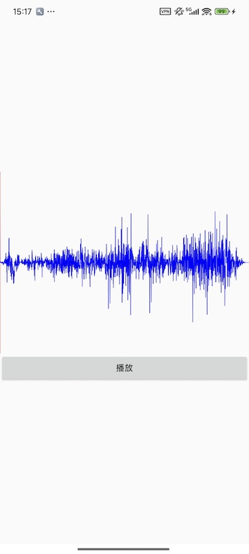
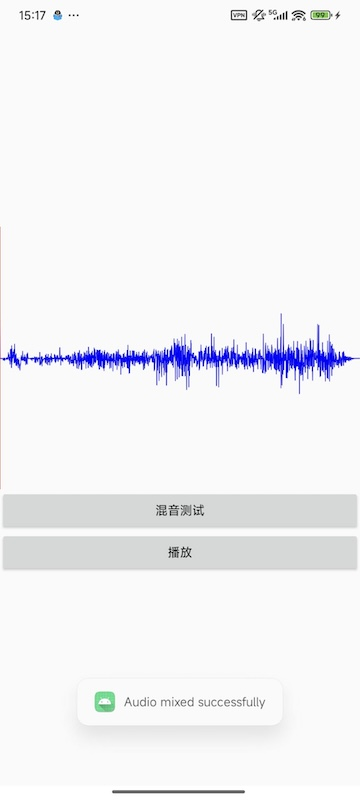

# audio_mix
mix audio demo

基于以下论文中的方法进行调研实现的demo，对比平均法等的差异和效果对比
https://kns.cnki.net/kcms2/article/abstract?v=__pNPjlwk1r_lUTyl5-0EwqSB29_hdrPxiZpU3PVQqLbAUwuJscKeGS5m9XSOC0Cxr6LrFjywjszscQ95oq6BQyFV0O6FVZWX53gIq3YpYMJIfbXO-1pR0qP4Uk4JIxacSzA4u4tvAlP9UyYTJR_1ufVdvuosW9jSyE9_h5I7VZ6wdaSkJt-Qw==&uniplatform=NZKPT&language=CHS、

source wav waveform

avg mix wav waveform

nlms mix wav waveform

